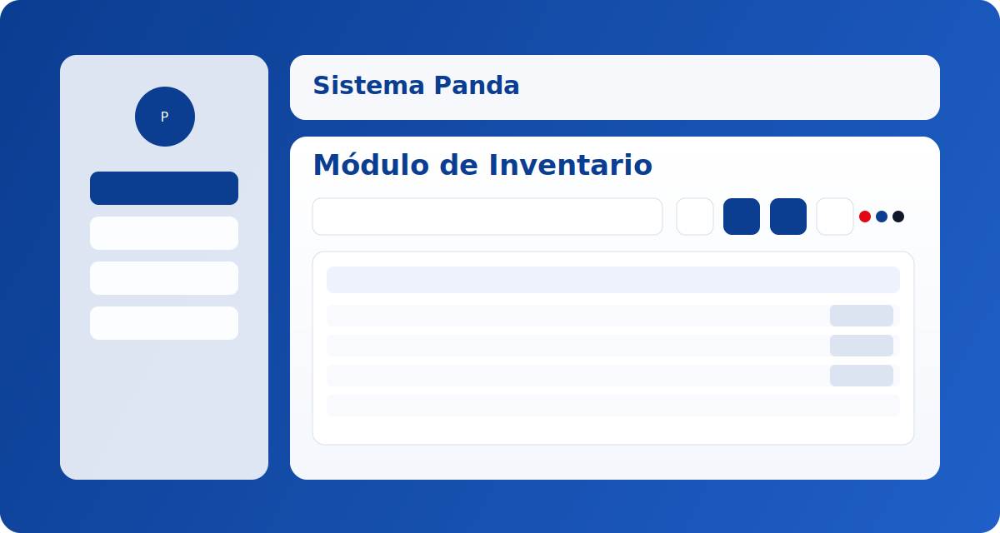
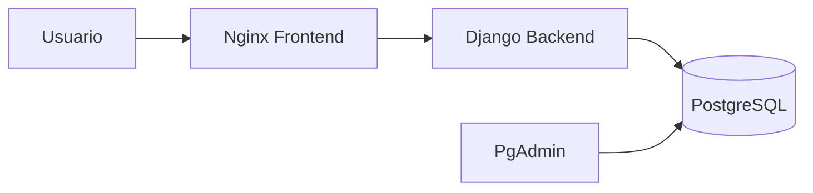
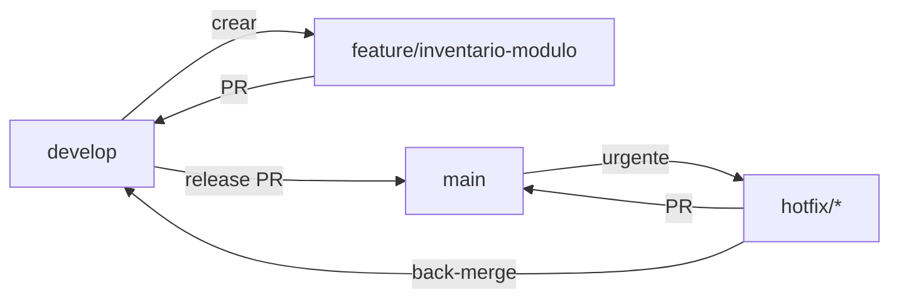

# Sistema Panda

[](#)
[](#)
[](#)
[](docs/branching-strategy.md)

Plataforma web para **Importaciones Panda** con arquitectura separada por contenedores:
- `db`: PostgreSQL
- `backend`: Django
- `frontend`: Nginx (reverse proxy)
- `pgadmin`: administración visual de DB

## Preview



## Arquitectura



## Estructura del Proyecto

```text
sistema-panda/
  backend/        # Django app, migraciones, seeders
  frontend/       # Nginx (proxy y estáticos)
  infra/          # Docker Compose
  docs/           # Arquitectura y flujo de ramas
  .github/        # Plantillas de PR
```

## Levantar en Local con Docker

```bash
cd infra
docker compose up -d --build
```

Accesos:
- Frontend: `http://localhost:8080`
- PgAdmin: `http://localhost:8081`
- Django admin (vía frontend): `http://localhost:8080/admin/`

## Variables de Entorno

- Raíz del proyecto: `.env`
- Compose/infra: `infra/.env`
- Backend local: `backend/.env`

## Migraciones y Seeder

```bash
cd backend
python manage.py makemigrations
python manage.py migrate
python manage.py seed_demo
```

## Flujo de Trabajo (Equipo)



Más detalle: [Branching Strategy](docs/branching-strategy.md) y [Contributing Guide](CONTRIBUTING.md).

## Reglas de Calidad

- No push directo a `main` ni `develop`.
- Todo cambio entra por Pull Request.
- Commits con convención: `feat`, `fix`, `chore`, `docs`, etc.
- PR pequeño, enfocado y con evidencia de pruebas.

## Roadmap Corto

- Inventario: CRUD completo + filtros avanzados.
- Proveedores: CRUD + contactos.
- Compras/Ventas: flujos transaccionales.
- Reportes: métricas operativas y comerciales.


